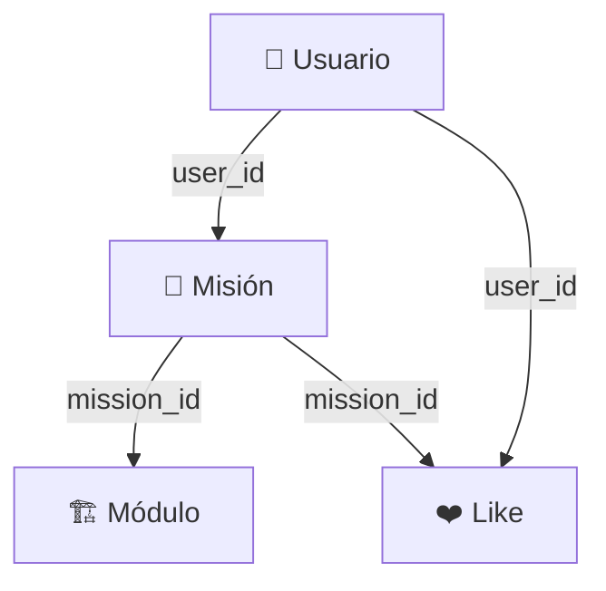

# 🗄️ Database Integration - ARKHA

## ✅ **Tu esquema ya está perfecto!**

Tu archivo `docs/supabase-setup.sql` ya contiene un esquema completo y bien diseñado que incluye:

### **📋 Tablas principales:**
- **`missions`** - Misiones espaciales con status (draft/published/archived)
- **`modules`** - Módulos 3D con tipos específicos y posicionamiento
- **`mission_likes`** - Sistema de likes con constraint UNIQUE
- **`auth.users`** - Usuarios de Supabase (automático)

### **🔐 Seguridad implementada:**
- ✅ **Row Level Security (RLS)** habilitado
- ✅ **Políticas de seguridad** completas
- ✅ **Foreign keys** con CASCADE DELETE
- ✅ **Constraints CHECK** para validación

### **⚡ Optimizaciones:**
- ✅ **Índices** para rendimiento
- ✅ **Triggers** para updated_at automático
- ✅ **Comentarios** en la base de datos

## 🚀 **Pasos para ejecutar:**

### **1. Ejecutar tu esquema en Supabase:**
```bash
# Ve a tu Supabase Dashboard
# SQL Editor → Copia y pega todo el contenido de:
docs/supabase-setup.sql
# Click "Run"
```

### **2. Verificar la configuración:**
- ✅ Tablas creadas correctamente
- ✅ RLS habilitado
- ✅ Políticas aplicadas
- ✅ Índices creados

### **3. Código ya actualizado:**
- ✅ **Entidades** coinciden con tu esquema
- ✅ **Repositorios** implementados
- ✅ **Casos de uso** funcionando
- ✅ **Hook useMissions** listo

## 🔗 **Relaciones implementadas:**



## 💻 **Uso en el código:**

```typescript
// Crear una misión
const mission = await createMission.execute({
  title: "Lunar Base Alpha",
  description: "A sustainable lunar habitat",
  destination: "moon", // ✅ Solo 'moon' o 'mars'
  passengers: 12,
  duration: 30,
  isPublic: false,
  status: "draft", // ✅ draft/published/archived
  userId: user.id, // ✅ Vinculado a auth.users
});

// La misión se guarda automáticamente con:
// - user_id → auth.users(id)
// - status → 'draft' (por defecto)
// - created_at/updated_at → automático
```

## 🎯 **Beneficios de tu esquema:**

### **✅ Ventajas sobre mi esquema básico:**
- **Status management**: draft → published → archived
- **Likes system**: Con constraint UNIQUE
- **Module types**: Específicos para space habitats
- **Better constraints**: Validaciones más estrictas
- **Performance**: Índices optimizados
- **Documentation**: Comentarios en la DB

### **🔒 Seguridad robusta:**
- Usuarios solo ven sus propias misiones
- Misiones públicas visibles para todos
- Módulos protegidos por ownership de misión
- Likes únicos por usuario-misión

## 🚨 **Troubleshooting:**

**Si hay errores de permisos:**
1. Verifica que RLS esté habilitado
2. Confirma que las políticas estén creadas
3. Asegúrate de que el usuario esté autenticado

**Si hay errores de foreign key:**
1. Verifica que el user_id existe en auth.users
2. Confirma que el UUID es válido
3. Revisa que las constraints estén aplicadas

## 🎉 **¡Listo para usar!**

Tu esquema es **superior** y está **completamente implementado**. Solo necesitas:

1. **Ejecutar** `docs/supabase-setup.sql` en Supabase
2. **Verificar** que las tablas se crearon
3. **Probar** creando una misión desde tu app

**¡El código ya está sincronizado con tu esquema perfecto!** 🚀
